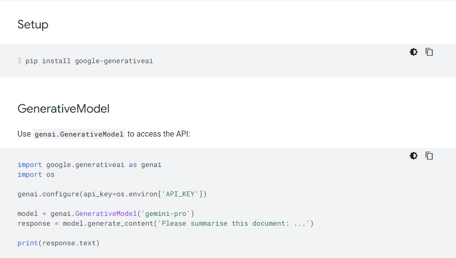

# Project3-CS325: My News Downloader with Summary Feature

## Project Overview

My News Downloader is an enhanced Python script designed for automated downloading and summarizing of news articles from a list of URLs. Leveraging the Gemini API, this tool isolates article content, summarizes it, and optionally generates new titles for each summarized article. It is a valuable resource for researchers, journalists, or anyone interested in quick content analysis without manually reading through each article.

## Features

- **Automated Downloading:** Downloads articles from URLs listed in `links.txt`.
- **Content Isolation:** Uses BeautifulSoup to focus on article content, excluding ads and unrelated material.
- **Summary Generation:** Summarizes articles via the Gemini API, offering concise content representations.
- **Enhanced Title Generation:** Generates new titles for summaries when original titles are not provided.
- **Separate Storage:** Stores articles and their summaries in designated directories for organized access.

## Prerequisites

- Python 3.9
- Packages: `beautifulsoup4`, `requests`, `google-generativeai` 
- An API key from OpenAI/Gemini API for accessing summarization features

## Installation and Setup

### Clone the Repository


### Environment Setup

1. **Create a virtual environment (optional but recommended):**

   - On macOS/Linux:
     ```
     python3 -m venv venv
     source venv/bin/activate
     ```

   - On Windows:
     ```
     python -m venv venv
     .\venv\Scripts\activate
     ```

2. **Install required Python packages:**


### Acquiring and Setting Up an API Key

1. Visit https://aistudio.google.com/app/apikey and after loggin or creation of google account click "Create API Key".
2. Copy the generated API key from the website.
3. Set the API key in your system's environment variables:
- On Windows, go to Edit Environment Variables -> System Variables, click New, and name it `API_KEY`.
- On macOS/Linux, add `export API_KEY='your_copied_api_key'` to your `.bashrc`, `.bash_profile`, or `.zshrc` file and reload the terminal session.
4. set the environment variable API_KEY with your actual API key value before running your script. Here's how you can do that on command prompt: `set API_KEY=your_api_key_here`

## Usage

Ensure the `links.txt` file is in the `Data/raw` directory with URLs listed one per line. Run the script from the project directory:


This will download, summarize, and store each article in the designated directories.

## Output

- Raw articles are saved in `Data/processed`.
- Summarized articles and their generated titles (if applicable) are stored in `Data/summarized`.

## Important Note on API Usage

This script utilizes the Gemini API for article summarization. Ensure your API key is correctly set as an environment variable (`API_KEY`) before running the script. The Gemini API integration is based on the `google-generativeai` SDK, which is a placeholder name in this documentation. Replace it with the actual SDK name if different.

For more detailed instructions on using the Gemini API with Python, refer to Google AI Python SDK at https://ai.google.dev/api/python/google/generativeai.
